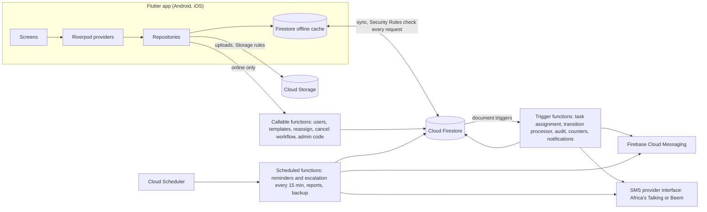

# ATMS architecture

Status: Sprint 0 baseline (7 Oct 2026). The product rules come from [PRODUCT_SPEC.md](PRODUCT_SPEC.md);
requirement IDs from [REQUIREMENTS.md](REQUIREMENTS.md); open questions from [DECISIONS.md](DECISIONS.md).

## 1. Principle: the phone asks, the server decides

The Flutter app reads through Firestore (with its offline cache) and writes only plain fields it
is allowed to. Everything that decides who sees what, where a workflow is, or what happened, is
done by Cloud Functions running with admin rights, and the Security Rules refuse the same writes
from any app, modified or not.



### Workflow move (MI 4, PDD 4.4)

```mermaid
sequenceDiagram
  participant A as App (maybe offline)
  participant F as Firestore
  participant W as processTransitionRequest (Cloud Function)
  A->>F: create transitionRequests/{id} {taskId, fromStep, action, comment}
  Note over A,F: queued on the phone while offline
  F->>W: onCreate trigger
  W->>F: transaction: read request, task, pinned template version, users
  alt every check passes
    W->>F: task.currentStep, owner, stepDeadline, viewerIds, status; audit entry; request.result = applied
    W->>F: notifications (then push, then SMS fallback)
  else any check fails (wrong step, not owner, missing comment ...)
    W->>F: request.result = rejected {code, alreadyDoneBy, alreadyDoneAt}; nothing else changes
  end
  F-->>A: request result appears; app shows "This step was already approved by Asha at 10:42."
```

The 14 checks of MI 4 run inside one Firestore transaction. "Exactly one successful transition"
comes from the transaction comparing the request's `fromStep` to the task's `currentStep`:
whichever request commits first moves the task; the second one re-reads, sees the step has
moved, and is rejected with the name and time from the latest audit entry. The request document
id is the idempotency key, and the function records `result` so a retried trigger does nothing.

## 2. Code structure

```
lib/
  core/          config (AppConfig, Firebase bootstrap, emulators), constants, errors (AppFailure,
                 friendly messages), localization (ARB files: app_en.arb, app_sw.arb), routing
                 (go_router, guards, NAVIGATION_MAP), theme, utils (logger without task titles)
  features/      auth, organisation, users, departments, tasks, workflows, notifications,
                 collaboration, confidentiality, dashboards, reports, audit
                 each with data/ (Firestore repositories), domain/ (models, interfaces),
                 presentation/ (screens, widgets, providers)
  shared/        models, widgets (sync banner, empty states), services (pagination), providers
test/            unit and widget tests (English and Kiswahili)
integration_test/ end-to-end scenarios from the prototype
functions/
  src/           auth, workflows, reminders, escalation, notifications (sms/), reports, counters,
                 audit, security, shared (model types, error codes, log redaction, config)
  test/unit      Jest unit tests (no emulator)
  test/rules     Security Rules tests against the Firestore and Storage emulators
firestore.rules, storage.rules, firestore.indexes.json, firebase.json
.github/workflows/ci.yml
```

State management: Riverpod. Repositories expose streams of pages (20 items) from Firestore;
providers hold screen state; widgets never call Firebase directly, so widget tests run with fakes.

## 3. Firestore schema

All data lives under `orgs/{org}` so one installation serves several organisations without
mixing data. Files live in Cloud Storage under `orgs/{org}/tasks/{task}/{attachmentId}`.
"Server" means only Cloud Functions write it (rules refuse app writes).

| Path | Fields | Written by |
| --- | --- | --- |
| `orgs/{org}` | name, timezone (`Africa/Dar_es_Salaam`), workingHoursEnabled, workingHours {start, end, days}, reminderHours [24, 1], escalationHours 24, escalationMaxLevel 2, smsEnabled, smsMonthlyCap (TZS), auditRetentionYears (>= 3), updatedAt | Server creates; verified admin edits settings |
| `orgs/{org}/departments/{dept}` | name, headUserId, active, createdAt, updatedAt | Verified admin |
| `orgs/{org}/users/{uid}` (doc id = Firebase Auth uid) | name, role (admin, manager, staff), deptId, supervisorId, managerChain [supervisor first], confidentialDepts [deptIds], jobRole, language (en, sw), active, muteComments, consentVersion, consentAcceptedAt | Server (adminUpsertUser); the user edits language, consent and muteComments |
| `.../users/{uid}/private/contact` | phone (E.164), email | Server; read by the user and verified admins |
| `.../users/{uid}/private/devices` | fcmTokens [max 10], updatedAt | The user's own app |
| `orgs/{org}/templates/{tpl}` | name, version, steps [{name, ownerType (user, role, supervisor), ownerRef, needsApproval, hoursAllowed}], active, staffCanStart | Server (saveTemplate) |
| `.../templates/{tpl}/versions/{v}` | frozen copy of name and steps for version v | Server |
| `orgs/{org}/tasks/{task}` | title, description, priority, status, deadline, creatorId, assigneeIds, deptId, confidential, participantIds, viewerIds, templateId, templateVersion, currentStep, stepDeadline, escalationLevel, overdue, createdAt, updatedAt; plus assignmentState, assignmentError, completionMode, completedByIds, needsCheck (D-06), returnReason, blockedReason, cancelReason, reassignmentNeeded, reassignmentReason, updatedBy, clientUpdatedAt, deleted, deletedAt, remindersSent | App for plain fields (see rules); server for workflow state, visibility, escalation, assignment |
| `.../tasks/{task}/comments/{c}` | authorId, text, mentions, createdAt, editedAt, removed, removedAt | Author (rules enforce the 15-minute window) |
| `.../tasks/{task}/attachments/{a}` | fileName, storagePath, sizeBytes (<= 10 MB), contentType, uploadedBy, createdAt | Uploader |
| `orgs/{org}/transitionRequests/{r}` | taskId, fromStep, action (submit, approve, reject, sendBack), toStep, comment, requestedBy, createdAt, clientCreatedAt, result {status, code, alreadyDoneBy, alreadyDoneAt, processedAt} | App creates; server fills result |
| `orgs/{org}/notifications/{n}` | userId, type, taskId, text (never a confidential title), read, openedAt, pushSent, smsSent, createdAt | Server; the owner marks read or opened |
| `orgs/{org}/audit/{entry}` | taskId or subjectUid (user changes), actorId, action, before, after, at, madeOffline, viewerIds, confidential; the document id is derived from the change so a retried trigger writes it once | Server only |
| `orgs/{org}/stats/{scope_id_day}` | scope (user, team, dept, org), scopeId, date, created, completed, onTime, overdue, escalated, plus per-step timing for workflows | Server only |
| `orgs/{org}/smsUsage/{yyyy-mm}` | sent, failed, costTzs, cap | Server only; verified admins read |
| `orgs/{org}/reports/{id}` | period, kind (weekly, monthly), scope, recipientIds, pdfPath, csvPath, createdAt | Server only |
| `orgs/{org}/secure/**` | admin second-factor codes, job bookkeeping | Server only; never readable |

### Deviations from the PDD data model (and why)

| Change | Reason |
| --- | --- |
| `phone`, `email`, `fcmTokens` moved to `users/{uid}/private/*` | Names must be readable by colleagues; phone numbers and push tokens must not (PDPA, A-12). |
| Users: `jobRole`, `muteComments`, `consentVersion`, `consentAcceptedAt` | Role-owned steps need a job title (D-05); NOT-5; consent record (SEC-7). |
| Tasks: `assignmentState`, `assignmentError` | Offline creation is checked by the server before anyone else can see the task (A-01). |
| Tasks: `completionMode`, `completedByIds` | Several assignees (A-02). |
| Tasks: `blockedReason`, `cancelReason` | TASK-3 reasons. |
| Tasks: `updatedBy`, `clientUpdatedAt` | Who made a change and whether it was made offline, for the audit log (AUD-2). |
| Tasks: `deleted`, `deletedAt` | Soft delete (TASK-11). |
| Tasks: `remindersSent` | Idempotency of reminders and escalations (REM-6). |
| Tasks: `needsCheck`, `returnReason`, status `awaiting_check` | Creator check on Done (D-06). |
| Tasks: `reassignmentNeeded`, `reassignmentReason` | Open tasks of a deactivated person are flagged (AUTH-5). |
| Templates: `staffCanStart`, `versions` subcollection | WF-12, WF-10. |
| Departments: `active`, timestamps | Deactivate instead of delete (A-13). |
| Audit: `viewerIds`, `confidential`, `subjectUid` | Read access by rules (A-15); user changes are logged against the person (AUD-1). |
| Stats: `scopeId`, `team` scope | Per-person and per-manager-tree counters for DASH-1, DASH-2. |
| New: `smsUsage`, `reports`, `secure`, `templates/{tpl}/versions` | NOT-6, REP-1, AUTH-10, WF-10. |
| Org: `escalationMaxLevel`, `smsEnabled`, `auditRetentionYears` | REM-4, NOT-6, AUD-4. |

### Indexes (firestore.indexes.json)

| Query | Index |
| --- | --- |
| My Tasks (assigned to me), optional status, by deadline | tasks: assigneeIds (array-contains) + assignmentState + deleted + status + deadline |
| My pending and refused requests | tasks: viewerIds (array-contains) + creatorId + assignmentState + deleted + deadline |
| Team Tasks, optional department, status, priority, by deadline | tasks: viewerIds (array-contains) + deleted + [deptId] + [status] + [priority] + deadline (8 variants) |
| Verified admin task list (non-confidential), same filters | tasks: confidential + deleted + [deptId] + [status] + [priority] + deadline (8 variants) |
| Task activity log | audit: taskId + viewerIds (array-contains) + at desc; audit: taskId + confidential + at desc |
| Admin audit screen | audit: confidential + at desc |
| Manager's assignee picker | users: managerChain (array-contains) + name |
| Department lists for confidential-access holders and admin stats | tasks: deptId + status |
| Escalation job | tasks: overdue + escalationLevel |
| Reminder job (open tasks by deadline) | tasks: status + deadline |
| Notification list | notifications: userId + createdAt desc |

Lists are live: one listener per list on the first `pages × 20` tasks; "Load more" adds a page.
The last two are added because the reminder job and the bell list run those exact queries.

## 4. Security model

Layers, from outermost:

1. **Firebase Authentication.** Phone code, email/password fallback. Cloud Functions create the
   sign-in account when an admin adds a user and set the custom claim `orgId`. With D-02,
   blocking functions refuse unknown numbers before an account exists.
2. **Session limits.** Rules and functions check the token's `auth_time`: 30 days, 7 days for
   admins (AUTH-8).
3. **Admin second factor.** Admin powers in rules and functions need the claim
   `adminVerifiedUntil`, set only after the second factor (D-01). An admin without it has staff
   visibility.
4. **App Check** (D-04) on Firestore, Storage and callable functions.
5. **Security Rules** (`firestore.rules`, `storage.rules`), default deny:
   - Membership: claim `orgId` matches the path, the user document exists, `active == true`,
     session fresh. A deactivated user is refused on the next request.
   - Tasks: readable if the reader is in `viewerIds`, or is a verified admin and the task is not
     confidential, or holds confidential access for the task's department. Soft-deleted tasks are
     hidden. Lists must be queried in a way the rules can prove (for example
     `viewerIds array-contains me`).
   - Writes: field allow-lists per action (creator edit, assignee status, add own completion,
     cancel with reason, soft delete). `viewerIds`, `currentStep`, `stepDeadline`,
     `escalationLevel`, `overdue`, `assigneeIds`, `deptId`, `confidential`, `assignmentState`
     and the status of workflow tasks are never in an app allow-list.
   - Comments and attachments inherit the task's read rule; comment edits are limited to 15
     minutes; nothing is hard-deleted.
   - Transition requests: created only by the requester for a task they can read; never updated
     or deleted by the app.
   - Audit, stats, notifications (apart from marking read), templates, users (apart from
     language, consent, mute), SMS usage, reports and `secure/` are server-only.
   - Storage: attachments readable and uploadable only by people who can read the task, at most
     10 MB, images, PDF and Office types only, never overwritten or deleted.
6. **Cloud Functions** re-check permissions for every callable and every request, write audit
   entries and redact titles, comment text and contact details from logs (`shared/redact.ts`).
7. **Notification text** is built on the server; a confidential task's title never goes into
   push text, SMS or the in-app notification text (NOT-4).

Data is encrypted in transit (TLS) and at rest (Google Cloud default). ATMS does not use, and must
not claim, end-to-end encryption: the server has to read tasks to route, remind and report.

## 5. Offline design

- Firestore offline persistence is on (100 MB cache). Lists are paged 20 at a time and only the
  user's own visible tasks are cached.
- Plain edits are field-level `update()` calls, so edits to different fields merge. Same-field
  conflicts: last write wins; the audit trigger records before and after of every write, so both
  values are kept (OFF-6). `clientUpdatedAt` versus the server commit time sets `madeOffline`.
- Workflow actions are transition requests, so an offline approval is only a request (OFF-2).
- Attachments upload from a queue persisted on the phone (Sprint 5).
- The sync banner reads Firestore's pending-writes metadata (Sprint 2).

## 6. Navigation map

Routes are defined in `lib/core/routing/` (see the NAVIGATION_MAP comment there, which is the
source of truth). Bottom navigation for signed-in users: **Tasks, Approvals, Dashboard,
Notifications, More**.

| Route | Who | Sprint |
| --- | --- | --- |
| `/setup-missing` | Anyone, when Firebase is not configured | 0 |
| `/sign-in/phone`, `/sign-in/code`, `/sign-in/email` | Signed out | 1 |
| `/not-invited` | Signed in, not added by an admin | 1 |
| `/onboarding/language`, `/onboarding/consent`, `/onboarding/notifications` | First sign-in | 1 |
| `/admin-verify?from=<path>` | Admins without a current second factor; returns to `from` | 1 |
| `/tasks`, `/tasks/new`, `/tasks/:id`, `/tasks/:id/edit` | All members | 2 |
| `/workflows/start` | Members allowed by the template | 3 |
| `/approvals` | All members (steps waiting for them) | 3 |
| `/notifications` | All members | 4 |
| `/dashboard` | All members; content by role | 6 |
| `/team-tasks`, `/reports` | Managers, admins | 2, 6 |
| `/more` | All members | 1 |
| `/admin/departments`, `/admin/users`, `/admin/users/new`, `/admin/users/:id`, `/admin/reporting-tree`, `/admin/settings` | Verified admins | 1 |
| `/admin/templates`, `/admin/templates/:id` | Verified admins | 3 |
| `/admin/audit` | Verified admins | 2 |

The router's guard sends signed-out users to sign-in, unknown numbers to `/not-invited`, new
users through onboarding, and blocks admin and manager routes for other roles. The guard is a
convenience: the rules and functions are the real protection.

## 7. Wireframes

- The clickable prototype (https://claude.ai/artifact/6pFjAuVHr86V9rTdCP1cPL) is the reviewed
  wireframe for flows and content. It is sample data only and is not production code.
- Sprint 0's Flutter screens are the initial screens: real layouts with translated labels and
  empty states, no fake data. They render in the widget tests in English and Kiswahili.

## 8. Environments

| Environment | Firebase project | Purpose |
| --- | --- | --- |
| Local | `demo-atms` (emulators only) | Development and all automated tests |
| Staging | to be created in `africa-south1` (D-03) | Load test, pilot rehearsal |
| Production | to be created | Pilot |

The app reads Firebase options from `--dart-define` values, so no keys are committed; without
them it starts on a "not configured" screen.
