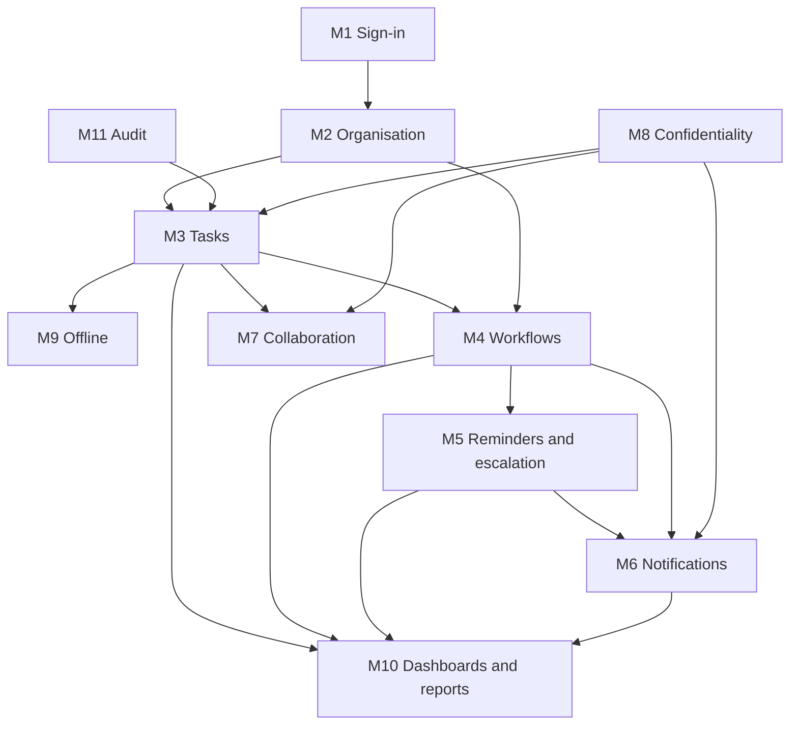

# ATMS implementation backlog

Sprints follow MI 38. Inside each feature the order is MI 39: data model, permissions, backend,
rules, backend tests, repository, Riverpod, UI, localisation, offline, test, document, changelog,
acceptance. Requirement IDs are in [REQUIREMENTS.md](REQUIREMENTS.md); acceptance items in
[ACCEPTANCE.md](ACCEPTANCE.md).

## Module dependencies

Key points:
- `managerChain` (M2) feeds `viewerIds` (M8), which every list query and rule depends on.
- The audit writer (M11) is needed by the first task write, so its foundation lands in Sprint 2.
- Workflows (M4) need users' `jobRole` and supervisors (M2) and the transition request path.
- Reminders and escalation (M5) need the notification dispatcher (M6) to deliver anything; the
  dispatcher's in-app channel lands with M5 and push/SMS in the same sprint.
- Confidentiality (M8) is in the rules from Sprint 0; Sprint 5 adds creating confidential tasks
  and choosing participants.
- Counters for dashboards (M10) hook into every task change, so they come after M3 to M6 are stable.

## Sprint 0: foundation (current)

| Item | Status |
| --- | --- |
| Read the PDD; extract requirements, acceptance criteria, entities, permissions, security, offline, notification and performance requirements | Done (REQUIREMENTS.md, ACCEPTANCE.md) |
| Contradictions and ambiguities | Done (DECISIONS.md) |
| Architecture, Firestore schema, security model, navigation map | Done (ARCHITECTURE.md) |
| Flutter project: structure, Riverpod, go_router, theme, EN/SW localisation, error mapping, pagination helper, sync banner, initial screens | See PROJECT_STATUS.md |
| Functions project: TypeScript, Jest, model types, error codes, session checks, log redaction, SMS interface with emulator-only mock | Done |
| Firestore and Storage rules with emulator tests | Done (85 of 87 pass here; 2 need CI, see KNOWN_ISSUES) |
| Indexes, emulator config | Done |
| CI build (GitHub Actions) | Running on robert-kamunde/atms |
| Firebase project (staging, production) | Created by Robert on the Blaze plan (8 Oct 2026); configuration needed in Sprint 1 |
| Clickable prototype reviewed with 3 to 5 future users | Prototype exists; review is Robert's |
| Testing strategy | Done (TESTING.md) |

## Sprint 1: sign-in, onboarding, organisation (M1, M2)

1. `adminUpsertUser` callable: create Auth user with phone, set `orgId` claim, write user and
   contact docs, validate department and supervisor, reject reporting loops, compute
   `managerChain` for the user and everyone below, audit "user added". Jest tests (loops, chain
   recompute).
2. Deactivate user: `active = false`, revoke refresh tokens, flag open tasks for the supervisor
   (`reassignmentNeeded`), audit "user deactivated".
3. Unknown-number handling: blocking function on Identity Platform (D-02), plus the
   `/not-invited` screen.
4. Admin second factor (D-01): `sendAdminCode` and `verifyAdminCode` callables, rate-limited,
   codes hashed in `secure/`, sets `adminVerifiedUntil`.
5. Invitation SMS through the SMS interface (the emulator mock until the D-09 provider is contracted).
6. App: phone sign-in, code entry, email fallback, language choice, consent screen, notification
   permission, session expiry handling (30/7 days).
7. Admin screens: departments, users, reporting tree view, organisation settings.
8. App Check registration in monitor-only mode for the pilot (D-04).
9. Rules tests for every new path; widget tests EN/SW.
Demo: an admin sets up an organisation; staff sign in by phone.

## Sprint 2: tasks, offline, audit foundation (M3, M9, M11)

1. `onTaskCreated`: assignment permission check (A-01), `viewerIds`, workflow start hook.
2. `onTaskWritten` audit writer: one entry per change with before/after, `madeOffline`.
3. Multiple-assignee completion (A-02); deadline-change notification hook.
4. Reassign callable; soft delete.
5. `viewerIds` recompute when `managerChain` changes.
6. App: My Tasks (paged, sorted by deadline), filters, Team Tasks, Kanban, task detail, create
   and edit, status changes with reasons, sync banner from pending writes.
7. Offline tests: flight mode, create, status, restart while offline, duplicates.
Demo: create, assign and finish tasks with Wi-Fi off.

## Sprint 3: workflow engine (M4)

1. `saveTemplate` callable with versions; template builder screen.
2. Start workflow: pin version, step 1 to the starter, step and overall deadlines.
3. `processTransitionRequest`: the 14 checks in one transaction; approve, reject, send back,
   submit, complete; role assignment (fewest open tasks, D-05); no-eligible-person admin error;
   result codes and "already approved by" message.
4. Cancel workflow callable.
5. Concurrency tests: simultaneous approvals produce exactly one move; retried triggers are
   no-ops; offline stale approval rejected.
6. App: start workflow, step tracker, approvals waiting, request result messages.
Demo: 5-step purchase request end to end with reject and send back.

## Sprint 4: reminders, escalation, notifications (M5, M6)

1. Scheduled job every 15 minutes: reminders, overdue, escalation levels, daily reminders after
   the top level, idempotency via `remindersSent`, working-hours holding (D-07), blocked tasks
   excluded.
2. Notification dispatcher: in-app document, FCM push, SMS fallback after 30 minutes unopened,
   escalations always SMS, confidential-safe text, mute rules.
3. SMS provider implementation (D-09), monthly cap and usage tracking.
4. App: bell list, push handling, opening a push marks it opened, escalation actions (extend,
   reassign, comment).
Demo: an overdue task escalates by push and SMS.

## Sprint 5: collaboration and confidentiality (M7, M8)

1. Comments, mentions (only people with access), edit window, removal, activity feed.
2. Attachments: on-phone photo compression to about 300 KB, 10 MB limit, upload queue, no
   automatic download on mobile data.
3. Confidential task creation with participant picker; full rules review.
4. Confidentiality emulator tests (already started in Sprint 0) extended to every new path.
Demo: comments, mentions and files; a confidential task invisible to others.

## Sprint 6: dashboards, reports, hardening (M10)

1. Counters (`stats`) maintained by triggers; per-step timing for bottlenecks.
2. Staff, manager and admin dashboards.
3. Weekly and monthly reports (PDF, CSV, optional email per D-08), confidential tasks as counts.
4. Kiswahili review by a native speaker.
5. Security testing pass, load test (1,000 users, 50,000 tasks).
Demo: manager dashboard and weekly PDF.

## Sprint 7: pilot preparation

Bug fixes, performance on a low-end phone over 3G, user guide, daily backup, Crashlytics,
release builds and signing, Play Store internal testing, pilot.
